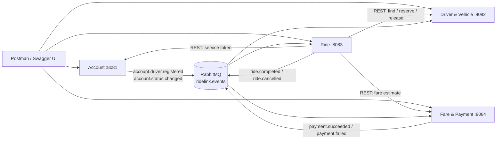

# RideLink

Backend for a fictional ride-sharing platform, built as four independent Spring Boot
microservices. Coursework for **IT3130 – Application Development (SLIIT)**.

Everything is simulated: locations are place names with made-up coordinates, and payments
use fixed placeholder tokens rather than any real provider.

---

## 1. Services

| # | Service | Folder | Port | Database | Owner |
|---|---|---|---|---|---|
| 1 | Account | [`account-service`](account-service) | 8081 | `ridelink_account` | _TBD_ |
| 2 | Driver & Vehicle | [`driver-vehicle-service`](driver-vehicle-service) | 8082 | `ridelink_driver` | _TBD_ |
| 3 | Ride Management | [`ride-service`](ride-service) | 8083 | `ridelink_ride` | _TBD_ |
| 4 | Fare & Payment | [`fare-payment-service`](fare-payment-service) | 8084 | `ridelink_payment` | _TBD_ |

Each service is a standalone application with its own `pom.xml`, its own database and its
own database user. **No service may read another's tables** — that is enforced by MySQL
grants, not just by convention. Cross-service data moves over REST or RabbitMQ events,
keyed by UUIDs.

There is deliberately **no shared code module**. The small duplication (security config,
error handler, event envelope) keeps the services independently deployable; the trade-off
is discussed in the report.

---

> **New to the project?** [`docs/getting-started.md`](docs/getting-started.md) is a
> step-by-step walkthrough from a fresh clone to a working demo, with a troubleshooting
> table keyed by the exact error you will see. The sections below are the condensed
> version.

## 2. Prerequisites

| Tool | Version | Notes |
|---|---|---|
| JDK | 21 (LTS) | `java -version` should report 21 |
| Maven | — | Use the bundled wrapper (`./mvnw`), no install needed |
| Docker | with Compose | For MySQL and RabbitMQ only |

---

## 3. Running it

### 3.1 Configure

```bash
cp .env.example .env
```

Then edit `.env` and replace every placeholder. Two values matter most:

- `JWT_SECRET` — must be **at least 32 bytes**, or the services refuse to start.
- `ADMIN_PASSWORD` — the admin account is seeded from this on first run.

`.env` is git-ignored and must never be committed.

### 3.2 Start the infrastructure

```bash
docker compose up -d
```

This starts MySQL 8 and RabbitMQ only. On first run it creates the four databases and four
users, each granted access to its own database alone.

- RabbitMQ management UI: <http://localhost:15672> (credentials from `.env`)

### 3.3 Start the services

**Order matters**: the Account service issues the tokens the others verify, and the Ride
service calls the other three.

```bash
./mvnw -f account-service/pom.xml spring-boot:run
./mvnw -f driver-vehicle-service/pom.xml spring-boot:run
./mvnw -f fare-payment-service/pom.xml spring-boot:run
./mvnw -f ride-service/pom.xml spring-boot:run
```

Each in its own terminal. On Windows use `mvnw.cmd`.

### 3.4 Check it is up

```bash
curl http://localhost:8081/actuator/health
curl http://localhost:8082/actuator/health
curl http://localhost:8083/actuator/health
curl http://localhost:8084/actuator/health
```

---

## 4. API documentation

Swagger UI is one of the two official clients for this project.

| Service | Swagger UI | OpenAPI JSON |
|---|---|---|
| Account | <http://localhost:8081/swagger-ui.html> | `/v3/api-docs` |
| Driver & Vehicle | <http://localhost:8082/swagger-ui.html> | `/v3/api-docs` |
| Ride | <http://localhost:8083/swagger-ui.html> | `/v3/api-docs` |
| Fare & Payment | <http://localhost:8084/swagger-ui.html> | `/v3/api-docs` |

To call a protected endpoint from Swagger UI: `POST /api/v1/auth/login` on the Account
service, copy the `accessToken`, press **Authorize** and paste it in.

---

## 5. Build and test

```bash
./mvnw verify                              # build and test all four services
./mvnw -f ride-service/pom.xml verify      # one service
./mvnw -f ride-service/pom.xml test        # tests only
```

Tests need **no MySQL and no RabbitMQ**: they run against H2 in MySQL mode with the AMQP
listeners disabled, so CI stays fast and hermetic.

Coverage reports (JaCoCo) land in `<service>/target/site/jacoco/index.html`.

---

## 6. Trying the whole workflow

The [Postman collection](postman) runs the full journey with assertions on every request.

```bash
newman run postman/RideLink.postman_collection.json \
  -e postman/RideLink.local.postman_environment.json
```

It covers, in order:

| Folder | What it proves |
|---|---|
| `00 Setup` | Admin login; register two passengers and two drivers |
| `01 Account & access` | Profile read/update, admin listing, suspend and reactivate |
| `02 Driver preparation` | Vehicle, licence, location, admin verification, going online |
| `03 Fare estimation` | Quotes for CAR and TUK; the published tariff rule |
| `04 Ride happy path` | Request → assign → accept → start → complete → history |
| `05 Completion & payment` | Poll for the final fare, pay by card, fetch the receipt |
| `06 Negative scenarios` | The failure cases below |

The negative scenarios are the interesting part:

- **(a)** No driver available (a VAN in GALLE) → `409 NO_DRIVER_AVAILABLE`
- **(b)** Cancelling a completed ride → `409 INVALID_RIDE_TRANSITION`
- **(c)** A passenger calling an internal endpoint → `403`; no token at all → `401`
- **(d)** Invalid input (bad e-mail, pickup equal to destination) → `400`
- **(e)** Card declined → `402`, then a successful retry
- **(f)** Cancellation fee charged after a driver had accepted

Note that step 05 **polls**: the final fare is computed from an event, so
`GET /payments/rides/{rideId}` returns `404 PAYMENT_NOT_READY` for a moment after
completion. That is eventual consistency working as designed, not a bug.

---

## 7. How the services talk to each other



**Synchronous REST** is used where the caller is waiting on the answer and it must be
consistent — a passenger needs the price in the same response, and a driver reservation
must resolve so that exactly one of two simultaneous requests wins.

**Asynchronous events** are used where the reaction can be a moment late and has several
interested parties. Completing a ride publishes one event that both the Driver service
(release the driver) and the Payment service (compute the fare) consume, so the driver's
"complete" request cannot fail because Payment happens to be restarting.

Full rationale: [`docs/architecture.md`](docs/architecture.md) and
[`docs/contracts/events.md`](docs/contracts/events.md).

---

## 8. Documentation

| Document | What is in it |
|---|---|
| [`docs/getting-started.md`](docs/getting-started.md) | Fresh-clone setup, step by step, with troubleshooting |
| [`docs/architecture.md`](docs/architecture.md) | Decomposition, data ownership, interaction styles and trade-offs |
| [`docs/business-rules.md`](docs/business-rules.md) | State machine, driver matching, fare and cancellation rules |
| [`docs/contracts/events.md`](docs/contracts/events.md) | Event catalogue — the source of truth for messaging |
| [`docs/contracts/asyncapi.yaml`](docs/contracts/asyncapi.yaml) | Machine-readable AsyncAPI 2.6 contract |
| [`docs/sequence-ride-booking.md`](docs/sequence-ride-booking.md) | Sequence diagrams for booking, completion and payment |
| [`docs/git-workflow.md`](docs/git-workflow.md) | Branching, commits, PRs and review expectations |
| [`docs/adr/`](docs/adr) | Architecture Decision Records |
| [`docs/ai-usage-log.md`](docs/ai-usage-log.md) | AI-assistance declaration for the report appendix |

---

## 9. Sample data

The Postman collection creates everything it needs. For manual testing, these are the
coordinates it uses:

| Place | Latitude | Longitude | Area |
|---|---|---|---|
| Colombo Fort | 6.9344 | 79.8428 | COLOMBO |
| Negombo | 7.2083 | 79.8358 | NEGOMBO |
| Katunayake | 7.1697 | 79.8842 | NEGOMBO |
| Kandy | 7.2906 | 80.6337 | KANDY |
| Galle | 6.0535 | 80.2210 | GALLE |

Simulated card tokens for `POST /payments/{id}/pay`:

| Token | Result |
|---|---|
| `tok_success` | Payment succeeds |
| `tok_declined` | `402` — card declined; retryable |
| `tok_insufficient_funds` | `402` — insufficient funds; retryable |
| anything else | `400` — malformed request, no payment recorded |

---

## 10. Errors

Every service returns the same RFC 7807 shape, so a client parses one format regardless of
which service answered:

```json
{
  "type": "about:blank",
  "title": "Invalid ride status transition",
  "status": 409,
  "detail": "Cannot move ride 3f2c... from COMPLETED to CANCELLED; COMPLETED is a terminal state",
  "code": "INVALID_RIDE_TRANSITION",
  "timestamp": "2026-09-28T10:20:00Z",
  "path": "/api/v1/rides/3f2c.../cancel",
  "correlationId": "8b1e..."
}
```

Branch on `code`, never on `title` or `detail`.

| Status | Codes |
|---|---|
| 400 | `VALIDATION_FAILED`, `MALFORMED_REQUEST` |
| 401 | `UNAUTHENTICATED`, `INVALID_CREDENTIALS` |
| 402 | `PAYMENT_DECLINED` |
| 403 | `FORBIDDEN`, `ACCOUNT_SUSPENDED`, `ACCOUNT_DEACTIVATED` |
| 404 | `NOT_FOUND`, `PAYMENT_NOT_READY` |
| 409 | `EMAIL_ALREADY_REGISTERED`, `ACTIVE_RIDE_EXISTS`, `NO_DRIVER_AVAILABLE`, `DRIVER_NOT_AVAILABLE`, `DRIVER_BUSY`, `INVALID_RIDE_TRANSITION`, `PAYMENT_ALREADY_COMPLETED`, `VEHICLE_ALREADY_REGISTERED`, `CONCURRENT_MODIFICATION` |
| 422 | `DRIVER_NOT_ELIGIBLE`, `FARE_ESTIMATE_EXPIRED`, `BUSINESS_RULE_VIOLATION` |
| 503 | `DOWNSTREAM_UNAVAILABLE` |

Send `X-Correlation-Id` on any request and it is echoed back, written to every log line and
carried onto the events that request produces — which is how one passenger action is
traced across all four services.

---

## 11. Security

- Every service is an OAuth2 Resource Server validating **HS256** JWTs **locally**. No
  service calls another to check a token, so driver lookups keep working when Account is
  down.
- The Account service is the **only** issuer.
- Roles: `PASSENGER`, `DRIVER`, `ADMIN`, and `SERVICE` for service-to-service calls.
- `/api/v1/internal/**` on the Driver service requires `ROLE_SERVICE`. A passenger holding
  a perfectly valid token cannot reserve drivers — demonstrated as negative scenario (c).
- Passwords are BCrypt (strength 10) and never returned by any endpoint.
- No card data is stored anywhere; the tokens above are fixed placeholders.

**Known limitation**, stated in the report: HS256 is symmetric, so every service holds the
same secret and could in principle mint tokens. The improvement is RS256 with Account
exposing a JWKS endpoint. Tokens also stay valid until expiry after a suspension, mitigated
by a short TTL and the `accountActive` flag the Driver service maintains from events.

---

## 12. Troubleshooting

| Symptom | Cause |
|---|---|
| Service exits with "JWT_SECRET must be set and at least 32 bytes" | `.env` missing or the secret is too short |
| `Access denied for user` on startup | `.env` credentials do not match what MySQL was initialised with. Run `docker compose down -v` to wipe the volume and start again |
| `404 PAYMENT_NOT_READY` after completing a ride | Expected for a moment — the fare is computed from an event. Poll, or check RabbitMQ is running |
| Ride assignment returns `503` | The Driver or Account service is not running |
| Ride assignment returns `409 NO_DRIVER_AVAILABLE` | No driver is VERIFIED, AVAILABLE, in that area, with a matching active vehicle and a location set in the last 30 minutes |
| Driver cannot go AVAILABLE | The `422` response lists every unmet requirement in its `reasons` array |

---

## 13. Repository layout

```
ridelink/
├── pom.xml                  # aggregator only — not a parent
├── docker-compose.yml       # MySQL + RabbitMQ
├── infra/mysql/             # database and per-service user bootstrap
├── .github/workflows/ci.yml # matrix build over the four services
├── docs/                    # architecture, contracts, business rules, ADRs
├── postman/                 # collection + environment
├── account-service/
├── driver-vehicle-service/
├── ride-service/
└── fare-payment-service/
```
