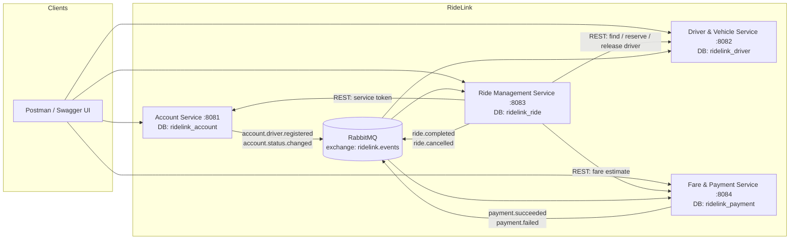

# RideLink architecture

---

## 1. Component diagram

---

## 2. Why these four services

The split follows **business capabilities**, not technical layers. Each service answers a
different question and changes for a different reason:

| Service | Owns the question | Changes when |
|---|---|---|
| Account | *Who are you, and may you act?* | Authentication or account policy changes |
| Driver & Vehicle | *Who can drive, and who is nearest?* | Supply, eligibility or dispatch policy changes |
| Ride Management | *What is happening on this trip?* | The trip lifecycle changes |
| Fare & Payment | *What does it cost, and has it been paid?* | Pricing or payment rules change |

A split by layer instead — a "controller service", a "database service" — would mean every
feature touched every service, which is the failure mode microservices exist to avoid.

The boundaries were also chosen so the **most likely changes stay inside one service**.
Pricing is the clearest case: surge pricing, night rates and promotions are all changes to
the Fare service alone, because nothing else knows how a fare is computed.

---

## 3. Data ownership

Each service owns exactly one database **and one database user**, granted privileges only
on its own schema (see `infra/mysql/init.sql`). Ownership is therefore enforced by MySQL,
not merely promised in a design document — a service physically cannot read another's
tables, even by mistake.

| Service | Database | Owns | Holds copies of |
|---|---|---|---|
| Account | `ridelink_account` | `account` | — |
| Driver & Vehicle | `ridelink_driver` | `driver_profile`, `vehicle`, `processed_event` | Driver name and phone; `accountActive` |
| Ride Management | `ridelink_ride` | `ride`, `ride_status_history`, `processed_event` | Fare estimate snapshot; `paymentStatus` |
| Fare & Payment | `ridelink_payment` | `fare_estimate`, `final_fare`, `payment`, `payment_attempt`, `receipt_counter`, `processed_event` | Ride pickup/destination on the fare |

### Deliberate duplication

Three pieces of data are stored in more than one place, each for a stated reason:

| Copy | Held by | Why not fetch it on demand |
|---|---|---|
| Driver name and phone | Driver service | Driver search must work even if Account is down, and matching runs on every ride request |
| `accountActive` | Driver service | Matching cannot afford a call to Account per candidate; a suspension is pushed as an event instead |
| Fare snapshot on the ride | Ride service | Fixes the price a passenger was quoted, even if tariffs change or the estimate expires |
| `paymentStatus` on the ride | Ride service | Reading a ride would otherwise require calling Payment, making ride history unavailable during a payment outage |

In each case the copy is **not authoritative**. The owning service remains the source of
truth; the copy exists to remove a runtime dependency, and is kept current by events.

---

## 4. Interservice interactions

| # | Interaction | Style | Why this style | Alternative considered |
|---|---|---|---|---|
| I1 | Ride → Fare: fare estimate on ride request | **Sync REST** | The passenger needs the price in the same response; there is nothing useful to show without it | gRPC — faster binary protocol, but adds proto tooling for low call volume, and REST is browsable in Swagger |
| I2 | Ride → Driver: search, reserve, release | **Sync REST** | Assignment needs an immediate yes/no, and a reservation must resolve consistently so exactly one of two simultaneous requests wins | Async queue — would make "no driver available" and race outcomes slow to report to a waiting passenger |
| I3 | Ride → Account: obtain a service token | **Sync REST** (client credentials) | The token is needed before the internal calls can be made | A shared static API key — simpler, but not role-based and never expires |
| I4 | Ride → Driver, Fare: `ride.completed`, `ride.cancelled` | **Async RabbitMQ** | Releasing the driver and pricing the trip must not block or fail the driver's "complete" call; two consumers want the same event | Sync calls from Ride — tighter coupling, and completion would fail if Payment were down |
| I5 | Account → Driver: `account.driver.registered`, `account.status.changed` | **Async RabbitMQ** | Profile creation and suspension propagation can be eventually consistent | Driver polling Account — wasteful and slower to react |
| I6 | Fare → Ride: `payment.succeeded`, `payment.failed` | **Async RabbitMQ** | Ride keeps a read-only copy; no need to block the payment call | Ride querying Payment on every read — adds a runtime dependency to a very common operation |

### The rule behind the choice

**Synchronous** when the caller cannot proceed without the answer, or when the result must
be consistent right now (a reservation).

**Asynchronous** when the reaction can be a moment late, or when several services care
about the same fact. `ride.completed` is the clearest example: one event, two independent
consumers, neither of which can make the driver's request fail.

### Trade-offs accepted

- **Eventual consistency.** The final fare appears a moment after completion, which is why
  `GET /payments/rides/{id}` returns a distinct `PAYMENT_NOT_READY` code rather than a
  plain 404 — so a client knows to poll rather than give up.
- **A broker is another moving part** that must be running and monitored.
- **Consumers must be idempotent.** RabbitMQ delivers at least once, so every consumer
  records processed event ids and protects its business keys with unique indexes.
- **Sync calls need timeouts.** Both are set explicitly; failures map to `503` naming the
  service at fault rather than surfacing as an opaque 500.

---

## 5. Microservices versus a monolith

### Arguments for the split, as they apply here

- **Independent development.** Four members own one service each and can work without
  blocking one another — the practical driver for this project.
- **Clear business boundaries.** Identity, supply, trip and money are genuinely different
  domains with different data models.
- **Independent scaling.** Driver search and ride traffic grow far faster than account
  creation; only the services that need it would be scaled.
- **Fault isolation.** A payment outage does not stop ride booking, because completion
  publishes an event rather than calling Payment.
- **Different data models per service.** The driver's geospatial, frequently-updated data
  has almost nothing in common with the payment service's financial records.

### Arguments against, honestly stated

- **Operational complexity.** Four applications plus a database and a broker, where one
  application would do.
- **Distributed data consistency.** No transaction spans services, so the system relies on
  idempotency and eventual consistency instead.
- **Network latency and partial failure.** Every interservice call is a call that can time
  out, and each one needs a considered failure path.
- **Harder end-to-end testing.** Nothing can be fully verified without all four running,
  which is why the Postman collection exists alongside the unit tests.
- **Duplicated cross-cutting code.** Security configuration, error handling and the event
  envelope are repeated four times.

### Verdict

**For a system of this size and load, a well-modularised monolith would be cheaper and
simpler.** The distribution here buys team independence and clean boundaries at a real cost
in complexity. That cost is worth paying when four people must work in parallel and the
domains genuinely differ — but it would not be justified by the traffic alone, and it is
more honest to say so than to pretend the load requires it.

---

## 6. Technology choices

| Concern | Choice | Reasoning |
|---|---|---|
| Language | Java 21 (LTS) | Required; LTS gives a stable target |
| Framework | Spring Boot 3.5.x | Required. 3.5 rather than 4.x deliberately: a mature line with settled library compatibility matters more than newness under a deadline |
| Build | Maven with the wrapper | Reproducible builds; contributors need no Maven install |
| Persistence | Spring Data JPA + MySQL 8 | One database and one user per service makes ownership enforceable |
| Migrations | Flyway | Versioned, reviewable schema; the same SQL runs on MySQL and on the H2 used in tests |
| Sync calls | Spring `RestClient` | Built into Spring 6; no Spring Cloud dependency for three call sites |
| Async | RabbitMQ (`spring-boot-starter-amqp`) | A topic exchange lets one event reach several consumers, which is exactly what `ride.completed` needs |
| Security | Spring Security OAuth2 Resource Server, HS256 | Every service verifies locally, so no service depends on Account being up to authorise a request |
| API docs | springdoc-openapi | Swagger UI is one of the two official clients for this project |
| Errors | RFC 7807 `ProblemDetail` | One error shape across four services; clients parse one format |
| Tests | JUnit 5, Mockito, AssertJ, `@WebMvcTest`, `@DataJpaTest`, `MockRestServiceServer` | Fast, hermetic, and each level tests something the others cannot |
| Coverage | JaCoCo | Evidence in CI |
| CI | GitHub Actions, matrix over the four services | One failing service still reports the others |
| DTOs | Java records + Bean Validation | Immutable and explicit; no Lombok, so nothing is generated invisibly |

---

## 7. SOLID in practice

Concrete examples, with class names, rather than a general claim:

| Principle | Where | What it buys |
|---|---|---|
| **Single responsibility** | `DriverEligibility` holds only the go-online rule; `DriverServiceImpl` orchestrates | The rule is pure logic and is unit-tested without a single mock |
| **Open/closed** | `DriverRankingStrategy` → `NearestThenLongestIdleStrategy` | A rating-based or surge-aware dispatch policy is a new class, not an edit to the matching service |
| **Open/closed** | `FareCalculator` → `DistanceTimeFareCalculator` | Surge or night pricing is a new implementation; both the estimate and final-fare paths pick it up at once |
| **Liskov substitution** | Every `ApiException` subclass carries its own status and code | One exception handler serves them all; a new business error needs no handler change |
| **Interface segregation** | `DriverService` (people) is separate from `DriverMatchingService` (services) | Different clients, different authorisation rules, different reasons to change |
| **Dependency inversion** | Services depend on `EventPublisher`, never `RabbitTemplate` | Business logic carries no AMQP imports and is testable with a mock; swapping transport touches one class |
| **Dependency inversion** | Controllers depend on service **interfaces** | Web-slice tests run against mocks, with no database or broker |

---

## 8. Limitations and future work

| Limitation | Impact | Improvement |
|---|---|---|
| **HS256 shared secret** | Any service holding the key could mint tokens | RS256 with Account exposing a JWKS endpoint, leaving the others only a public key |
| **No transactional outbox** | A crash between commit and publish loses an event | Write events to an outbox table in the same transaction and publish from there |
| **Tokens valid until expiry** | A suspended user keeps access for up to the TTL | Short TTL plus the `accountActive` flag mitigate it; a token blacklist or introspection would close it |
| **No API gateway** | Clients must know four base URLs | A gateway would centralise routing, rate limiting and CORS |
| **Simulated location** | Drivers do not really move | A real GPS feed with a geospatial index |
| **Straight-line distance × 1.3** | Fares are approximate | A routing engine for true road distance |
| **Eventual consistency is visible** | Clients must poll after ride completion | Push the result to the client, or have the Ride service expose the fare once it knows it |
| **No service discovery** | URLs are configuration | Fine at four services; a registry would help at forty |
