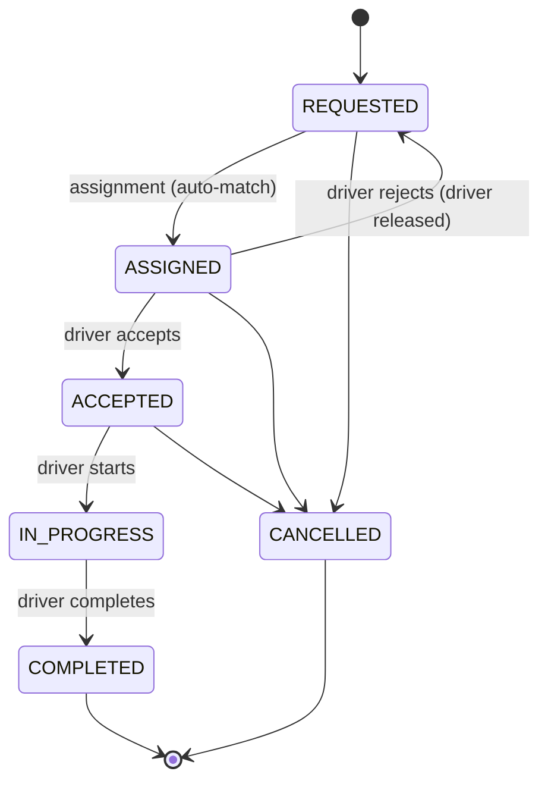

# RideLink business rules

Every rule below is implemented behind an interface so it can change without
touching its callers, and each has direct unit-test coverage. This page is the
specification; the code is expected to match it exactly.

---

## 1. Ride state machine

Owned by **Ride Management Service** (`domain/RideStatus`).



### Allowed transitions

| From | To | Triggered by |
|---|---|---|
| `REQUESTED` | `ASSIGNED` | `POST /rides/{id}/assignment` (passenger or admin) |
| `REQUESTED` | `CANCELLED` | `POST /rides/{id}/cancel` |
| `ASSIGNED` | `ACCEPTED` | `POST /rides/{id}/accept` (assigned driver) |
| `ASSIGNED` | `REQUESTED` | `POST /rides/{id}/reject` (assigned driver) |
| `ASSIGNED` | `CANCELLED` | `POST /rides/{id}/cancel` |
| `ACCEPTED` | `IN_PROGRESS` | `POST /rides/{id}/start` (assigned driver) |
| `ACCEPTED` | `CANCELLED` | `POST /rides/{id}/cancel` |
| `IN_PROGRESS` | `COMPLETED` | `POST /rides/{id}/complete` (assigned driver) |

**Everything else is rejected** with `409 INVALID_RIDE_TRANSITION`.

Two consequences worth stating explicitly, because they are the negative cases
demonstrated in the Postman collection:

- **`IN_PROGRESS` cannot be cancelled.** Once the passenger is in the vehicle,
  cancellation is not a meaningful action; the trip is either completed or
  handled out of band.
- **`COMPLETED` and `CANCELLED` are terminal.** No transition leaves them, so a
  completed ride can never be cancelled, re-started or re-paid.

The rule lives in an allowed-transitions map on the `RideStatus` enum, and
`Ride.transitionTo(...)` is the only way to change status. Because the check
sits on the domain object rather than in each controller, no endpoint can
bypass it.

Every accepted transition appends a `RideStatusHistory` row
(`fromStatus`, `toStatus`, `changedBy`, `changedAt`, `note`), which is what
`GET /rides/{id}/history` returns.

---

## 2. Driver matching rule

Owned by **Driver & Vehicle Service**, served by
`GET /api/v1/internal/drivers/available`.

### 2.1 Filter

A driver is a candidate only if **all** of the following hold:

| # | Condition | Why |
|---|---|---|
| 1 | `availability = AVAILABLE` | Not offline and not already on a trip |
| 2 | `verificationStatus = VERIFIED` | Admin has checked the licence |
| 3 | `accountActive = true` | Account not suspended (kept in sync by `account.status.changed`) |
| 4 | `licenceExpiry` is not in the past | Legally able to drive |
| 5 | Has an **active** vehicle whose `type` equals the requested `vehicleType` | The passenger asked for a specific class |
| 6 | `serviceArea` equals the requested area | Drivers operate in one area |
| 7 | `locationUpdatedAt` within the last **30 minutes** | A stale position would produce a meaningless distance |
| 8 | Haversine distance from pickup ≤ `radiusKm` | Close enough to be worth dispatching |

`radiusKm` defaults to **5** and is capped at **20**. `limit` defaults to **5**.

### 2.2 Rank

1. **Distance ascending** — the nearest driver reaches the passenger soonest.
2. **`availableSince` ascending** — on a distance tie, the driver who has been
   waiting longest wins. This is the fairness rule: without it, one driver
   parked next to a busy pickup point would take every ride.

Implemented as the `DriverRankingStrategy` interface with a
`NearestThenLongestIdleStrategy` implementation. A different policy (highest
rating, fewest trips today, surge-aware) is a new class, not an edit to the
matching service — this is the Open/Closed example cited in the report.

### 2.3 Distance

Straight-line **Haversine** distance on a spherical Earth, radius 6371 km.
Locations are fictional but internally consistent: Colombo Fort → Negombo comes
out at roughly 32 km, which the unit test asserts with a tolerance.

### 2.4 Reservation

Matching alone does not assign anyone. The Ride service must call
`POST /internal/drivers/{driverId}/reserve`, which moves `AVAILABLE -> BUSY`
under an optimistic lock (`@Version`) and sets `currentRideId`.

- If the driver is no longer `AVAILABLE`, the call returns
  `409 DRIVER_NOT_AVAILABLE` and the Ride service tries the next candidate.
- This is what makes the race safe: two passengers requesting simultaneously
  cannot both win the same driver, because the second write fails the version
  check.

`POST /internal/drivers/{driverId}/release` is the inverse and is
**idempotent**: it moves `BUSY -> AVAILABLE` only when `currentRideId` equals
the supplied `rideId`, and otherwise succeeds without changing anything. That
matters because it is called both synchronously (on reject) and from the
`ride.completed` / `ride.cancelled` consumers, which may redeliver.

### 2.5 Driver eligibility to go AVAILABLE

`PATCH /drivers/me/availability` to `AVAILABLE` requires:
verified, active vehicle, licence not expired, and a location on file.
Failure returns `422 DRIVER_NOT_ELIGIBLE` **with the list of failed reasons**,
so the driver is told what to fix rather than just being refused.

`BUSY` can never be set manually, and a `BUSY` driver cannot go `OFFLINE`
(`409`) — otherwise a driver could abandon a ride in progress.

---

## 3. Fare rule

Owned by **Fare & Payment Service** (`FareCalculator` interface →
`DistanceTimeFareCalculator`). Tariffs are read from `application.yml` under
`ridelink.tariffs`, never hard-coded, so pricing changes need no recompile.

### 3.1 Formula

```
roadDistanceKm = haversine(pickup, destination) × 1.3
durationMin    = roadDistanceKm / 25 km/h × 60
fare           = base + (perKm × roadDistanceKm) + (perMin × durationMin)
total          = max(fare, minimumFare)
```

`total` is a `BigDecimal` rounded **HALF_UP to 2 decimal places**, currency
**LKR**. `BigDecimal` rather than `double` because money must not carry binary
floating-point error.

Two deliberate simplifications, both stated in the report:

- **Road-winding factor 1.3** stands in for a real routing engine. A straight
  line underestimates a real road route; 1.3 is a common rule-of-thumb
  multiplier.
- **Fixed 25 km/h** average city speed stands in for live traffic data.

### 3.2 Tariffs

| Vehicle | Base | Per km | Per min | Minimum |
|---|---|---|---|---|
| TUK | 100.00 | 80.00 | 3.00 | 200.00 |
| CAR | 150.00 | 100.00 | 5.00 | 300.00 |
| VAN | 250.00 | 140.00 | 7.00 | 500.00 |

### 3.3 Estimates

`POST /fares/estimates` stores the breakdown with `expiresAt = createdAt + 15
min`. The Ride service snapshots the estimate onto the ride at request time, so
a later tariff change cannot alter the price a passenger was quoted.

### 3.4 Final fare

Triggered by the `ride.completed` event, not by an HTTP call — the driver's
"complete" action must not fail because Payment is slow or down.

- **Distance:** `actualDistanceKm` when the driver reported one, otherwise the
  estimated distance.
- **Duration:** real elapsed `startedAt → completedAt` in minutes, rounded
  **up**, minimum 1. A 40-second trip is billed as one minute rather than zero.
- Same formula and same minimum fare as the estimate.

The final fare therefore usually differs slightly from the estimate. That is
intended behaviour, not a bug.

### 3.5 Cancellation fee

Triggered by `ride.cancelled`.

| `cancelledBy` | `previousStatus` | Fee |
|---|---|---|
| `PASSENGER` | `ACCEPTED` | **LKR 100.00** |
| `PASSENGER` | `REQUESTED` or `ASSIGNED` | none |
| `DRIVER` | any | none |
| `ADMIN` | any | none |

The reasoning: a fee is only fair once a driver has actually committed to the
trip and started moving toward the pickup. When no fee applies, **no payment
record is created at all**, so `GET /payments/rides/{rideId}` stays 404 for
that ride.

---

## 4. Payment simulation

No real payment provider is contacted. `POST /payments/{paymentId}/pay`:

| `method` | `cardToken` | Outcome | HTTP |
|---|---|---|---|
| `CASH` | — | `SUCCEEDED` | 200 |
| `CARD` | `tok_success` | `SUCCEEDED` | 200 |
| `CARD` | `tok_declined` | `FAILED` (`CARD_DECLINED`) | 402 `PAYMENT_DECLINED` |
| `CARD` | `tok_insufficient_funds` | `FAILED` (`INSUFFICIENT_FUNDS`) | 402 `PAYMENT_DECLINED` |
| `CARD` | anything else | rejected, no attempt recorded | 400 |

Rules:

- **No card data is ever stored.** The tokens above are fixed placeholders, not
  card numbers, and only the token *outcome* is persisted.
- A payment already `SUCCEEDED` returns `409 PAYMENT_ALREADY_COMPLETED`. The
  unique index on `payment(ride_id, type)` backs this up at the database level,
  so even a redelivered `ride.completed` event cannot create a second charge.
- A `FAILED` payment **can** be retried; each try appends a `PaymentAttempt`
  row, which gives an audit trail of how a payment eventually succeeded.
- On success a `receiptNumber` is allocated in the form `RL-<year>-<6 digits>`
  (e.g. `RL-2026-000123`) from a database counter, so numbers are gapless and
  unique.

---

## 5. Account rules

Owned by **Account Service**.

- **Password policy:** at least 8 characters, containing at least one letter and
  at least one digit. Stored as BCrypt (strength 10); `passwordHash` is never
  returned by any endpoint.
- **Email** is unique and stored lowercased, so `Nimal@x.lk` and `nimal@x.lk`
  are the same account. A duplicate registration returns
  `409 EMAIL_ALREADY_REGISTERED`.
- **Phone** must match the Sri Lankan mobile format `+94` followed by 9 digits.
- **Login** returns `401 INVALID_CREDENTIALS` for a bad email *or* a bad
  password — the same message either way, so the endpoint cannot be used to
  discover which emails are registered.
- A suspended or deactivated account that supplies correct credentials gets
  `403 ACCOUNT_SUSPENDED` / `ACCOUNT_DEACTIVATED`, not a token.
- **An admin cannot change their own status**, which prevents an admin locking
  themselves — and possibly every admin — out of the system.
- The seeded admin is created at startup from `ADMIN_EMAIL` / `ADMIN_PASSWORD`
  **only if no account with that email exists**, so restarting the service never
  resets a changed admin password.

---

## 6. Passenger rules

- A passenger may hold **only one active ride** at a time (active = any status
  that is not `COMPLETED` or `CANCELLED`). A second request returns
  `409 ACTIVE_RIDE_EXISTS`.
- Pickup and destination must differ (`400`), checked on the place name and the
  coordinates, since a zero-distance ride would bill only the minimum fare for
  no journey.
