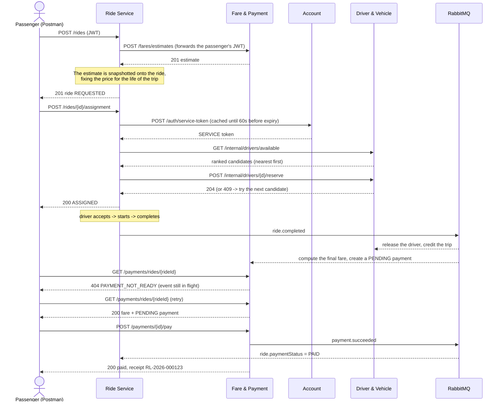
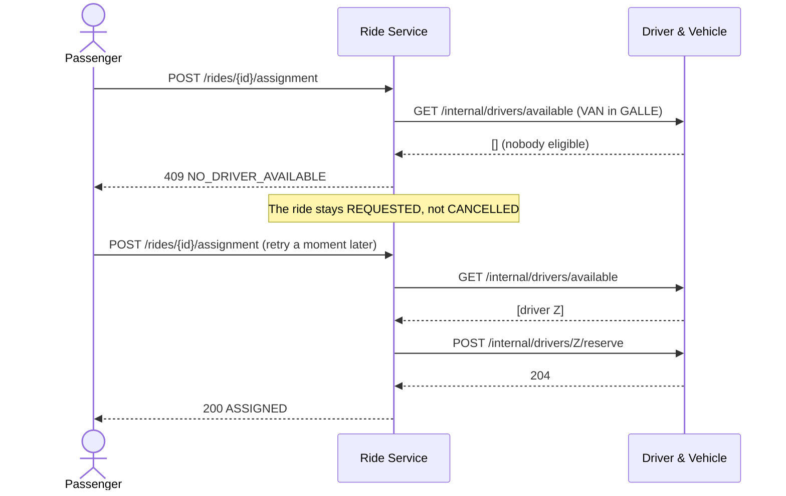
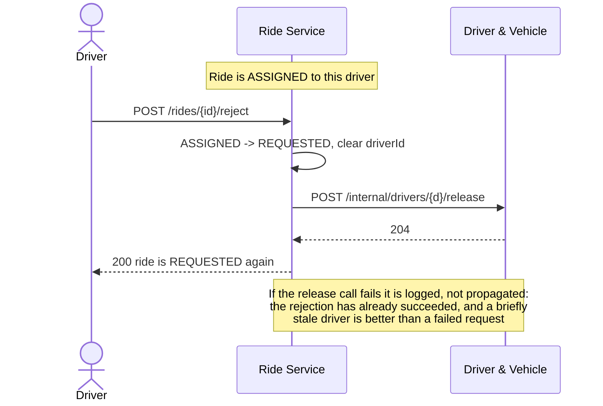
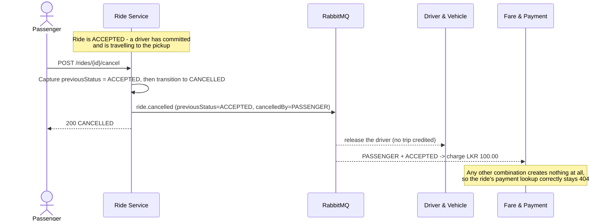
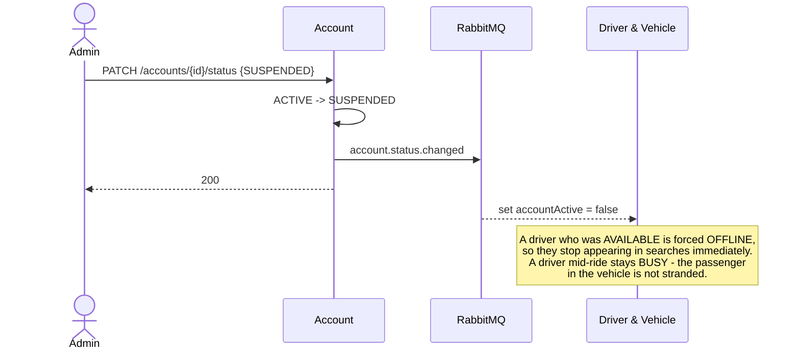

# Sequence diagrams

---

## 1. The full journey: request to payment



The single 404 in the middle is the visible face of eventual consistency. It carries the
distinct code `PAYMENT_NOT_READY` rather than a plain `NOT_FOUND` precisely so a client can
tell "not yet" from "no such thing" and poll accordingly.

---

## 2. Assignment, including the race

This is the only place in RideLink where two requests genuinely compete for the same row.

```mermaid
sequenceDiagram
  actor P1 as Passenger 1
  actor P2 as Passenger 2
  participant R as Ride Service
  participant D as Driver & Vehicle

  P1->>R: POST /rides/{a}/assignment
  P2->>R: POST /rides/{b}/assignment

  R->>D: GET /internal/drivers/available (for ride a)
  D-->>R: [driver X, driver Y]
  R->>D: GET /internal/drivers/available (for ride b)
  D-->>R: [driver X, driver Y]
  Note over R,D: Both searches see driver X as available:<br/>searching does not reserve anyone

  R->>D: POST /internal/drivers/X/reserve (ride a)
  activate D
  Note over D: AVAILABLE -> BUSY under an optimistic lock
  D-->>R: 204 reserved
  deactivate D

  R->>D: POST /internal/drivers/X/reserve (ride b)
  activate D
  Note over D: X is no longer AVAILABLE;<br/>the version check fails
  D-->>R: 409 DRIVER_NOT_AVAILABLE
  deactivate D

  Note over R: A 409 is an expected outcome, not an error:<br/>move on to the next candidate
  R->>D: POST /internal/drivers/Y/reserve (ride b)
  D-->>R: 204 reserved

  R-->>P1: 200 ASSIGNED to X
  R-->>P2: 200 ASSIGNED to Y
```

Both passengers get a driver. Without the version check, both rides would have been
assigned driver X and one passenger would have been left waiting for a car that never came.

---

## 3. No driver available



Leaving the ride `REQUESTED` is a deliberate choice: the passenger still wants a ride, so
cancelling on their behalf would throw away a valid booking and force them to start again.

---

## 4. Driver rejection



---

## 5. Cancellation and the fee rule



`previousStatus` has to travel on the event because by the time it is published the ride is
already `CANCELLED` — the Fare service could not otherwise tell a late cancellation from an
early one.

---

## 6. Suspension propagating to dispatch



Matching never calls the Account service, so without this event a suspended driver would
keep taking rides until someone noticed.
